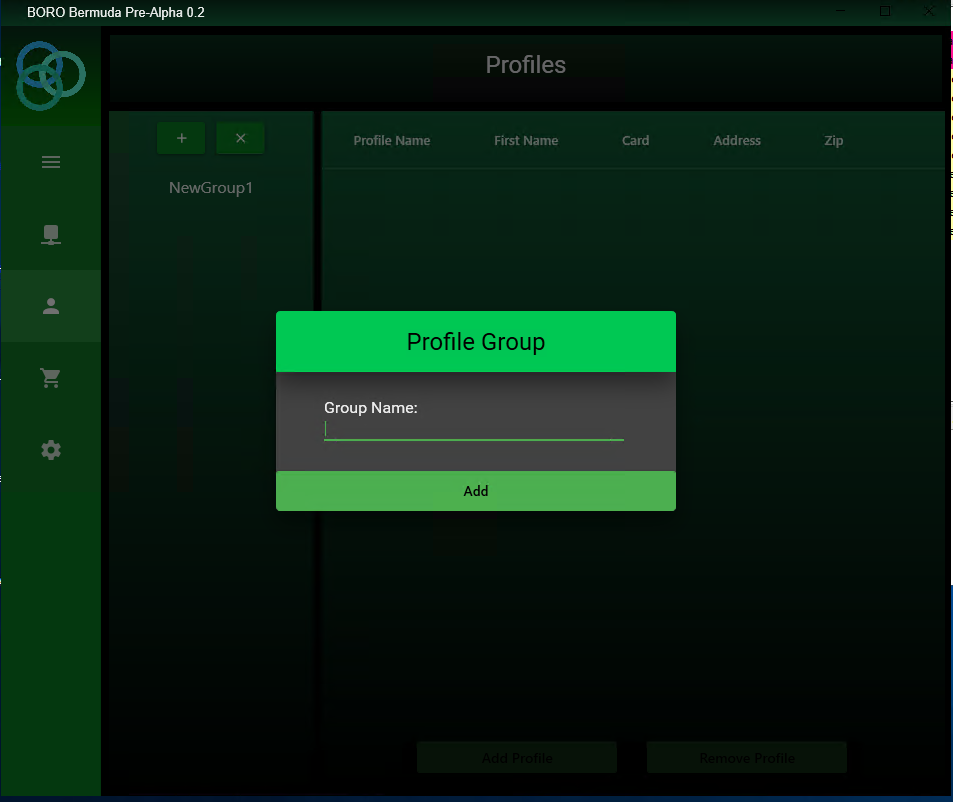
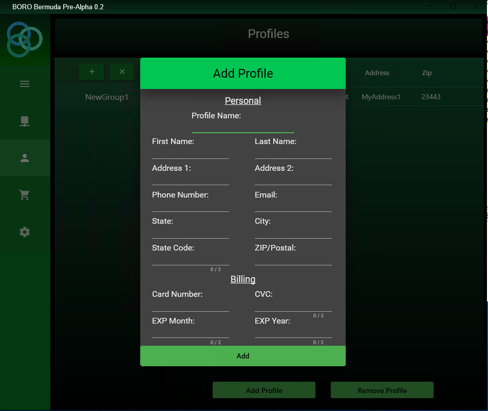
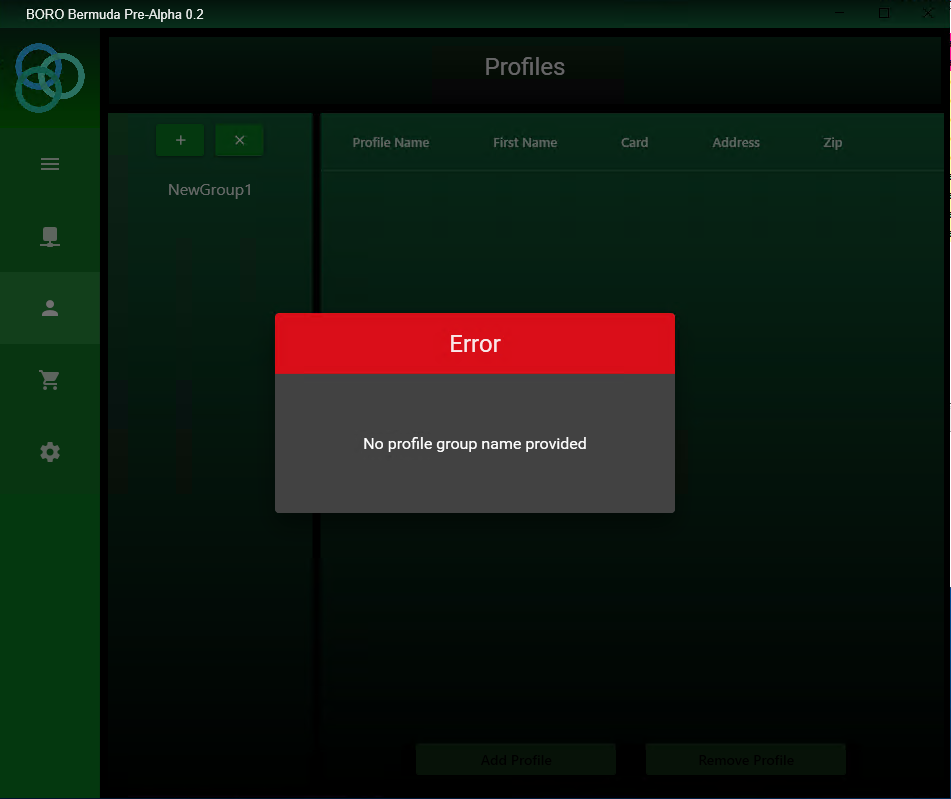
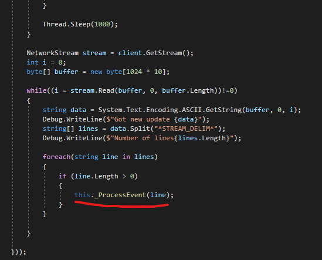
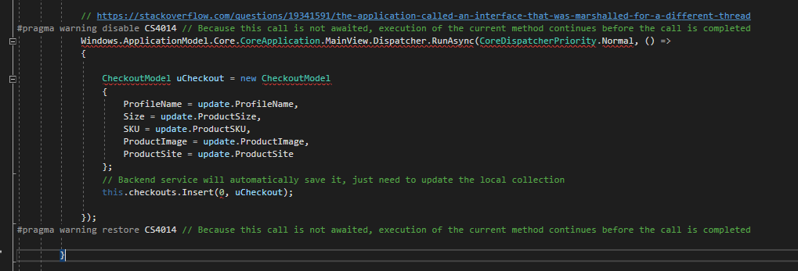

[![LinkedIn][linkedin-shield]][linkedin-url]

<!-- PROJECT LOGO -->
 

  <h3 align="center">C# and WPF Consumer Desktop Application</h3>
  

    Building a responsive and functional UI for automating bulk-orders of highly demanded retail products (Clothing, Shoes, Sports Goods) on Windows.
     
  

<!-- ABOUT THE PROJECT -->
## About The Project

This project is actually a "sister" project to another of my personal portfolio items. Which you can access by clicking [HERE.](https://github.com/ibrahimelement/CSHARP_UWP_DesktopApplication "HERE")

Now, if you have actually checked out that project, you will remember that I said that Microsoft is actively trying to build a new framework to modernize legacy code. However, I learned a big lesson about working with Microsoft and bleeding edge code; ***unsupported platforms and bugs***. Additionally, I found out that this is not a one-time thing with Microsoft, rather, a recurring pattern...

So what issues exist with UWP and WinUI?

1. WinUI did not have support for built-in XAML visualization on VS Studio (until very recently).

2. WinUI is **not supported** on Windows 7, older versions of Windows 10 (which many **MANY** users actively use [huge portion of the market]), AND the cherry on top, unsupported on many versions of Windows Server!

3. Windows has implemented access-control permissions with UWP-based applications, some-of-which are quite odd and difficult to overcome. Developers need to manually ask for permissions from users and this a relatively new feature.

**Note:** This was a massive issue for me as a developer, at the time of developing I completely overlooked this. Once deployed, I got reports from hundreds of customers running into bugs and conflicts. I realized that I made a mistake and needed to stick with what worked rather than what looked pretty...

That meant that I needed to migrate my app over to use WPF instead...

What are the objectives of this application:
* Migrate existing app to use WPF; replace unsupported "modern" functionality with traditional methodologies.
* Allow for thousands of updates on the UI in real-time using delegates and multi-threading.
* Build frameworks to allow for continuous deployment (CD) and reduce redundant activities when pushing out releases.

(<a href="#readme-top">back to top</a>)

### Built With

This project was built with the following technologies:

1. C#: 
  
2. WPF 

3. XAML: 

(<a href="#readme-top">back to top</a>)

<!-- ROADMAP -->
## Features Checklist

- [x] Design pages using XAML (Licensing, Profiles, Billing, Settings, Overview)
- [x] Design modals using XAML (Create profile, Create billing)
- [x] Use Delegates to push real-time notifications to the UI (from another Daemon)
- [x] Implement an MVVM structure in Code
- [x] Create an interface to communicate with the backend Daemon (another language)

(<a href="#readme-top">back to top</a>)

## Interesting Challenges

Prior to working on this project, I was only really familiar with an MVC (Model - View - Controller) type application. However, while studying, I came across something called the MVVM model (Model - View - View Model) structure. Illustrated below:

 

The backend daemon runs as another process on the OS and was written in C++ for specific purposes. Messages are sent back and forth between the UI and Backend via a socket tunnel established in the Backend Service (Services/BackendService.cs).

**Bug & Solution:**
Interestingly, there is something called thread-affinity where you can only publish UI updates from the thread that manages that resource. I tried using 2-way binding to properly update the UI states, but for some reason it wasn't updating. To solve this I had to write code that would manually change the state of a task. Illustrated below:

https://stackoverflow.com/questions/19341591/the-application-called-an-interface-that-was-marshalled-for-a-different-thread

(<a href="#readme-top">back to top</a>)

<!-- MARKDOWN LINKS & IMAGES -->
[linkedin-shield]: https://img.shields.io/badge/-LinkedIn-black.svg?style=for-the-badge&logo=linkedin&colorB=555
[linkedin-url]: https://www.linkedin.com/in/ibrahim-element-7bb674213/
